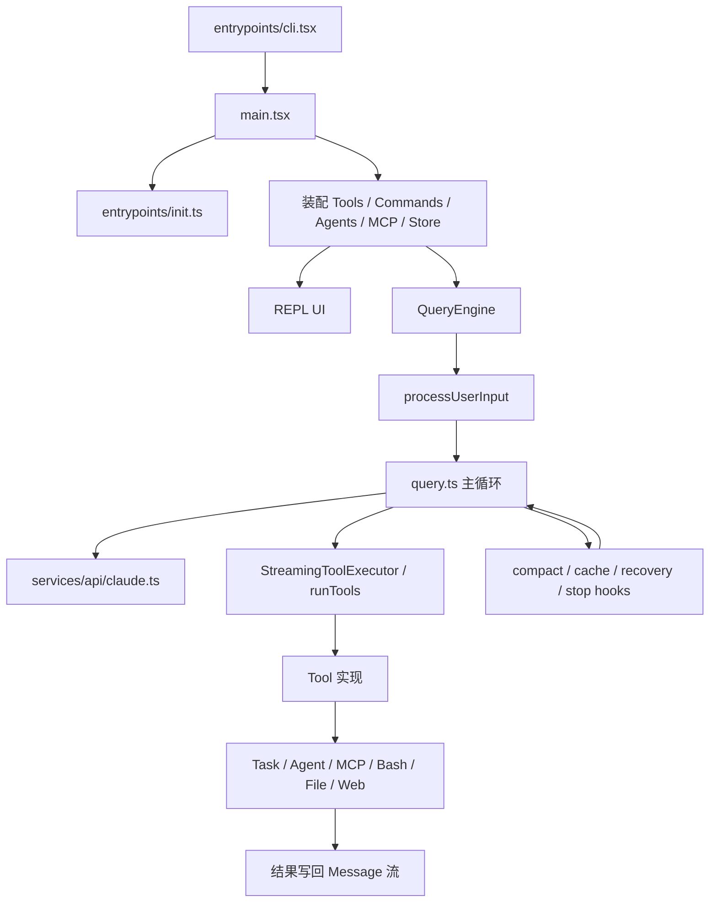

# Claude Code `src` 源码分析

## 说明

这份文档不是逐文件罗列，而是沿着 Claude Code 最核心的主干去拆：

- 启动与装配：它如何把配置、权限、工具、命令、插件、MCP、UI 装起来
- 主循环：它如何从用户输入进入模型，再进入工具，再回到模型
- Agent：它如何把“子代理”做成真正可运行、可隔离、可恢复的系统
- 工程化能力：它如何处理权限、上下文压缩、缓存、恢复、任务可见性

我重点阅读了这些模块：

- `claude-code/src/entrypoints/cli.tsx`
- `claude-code/src/main.tsx`
- `claude-code/src/entrypoints/init.ts`
- `claude-code/src/QueryEngine.ts`
- `claude-code/src/query.ts`
- `claude-code/src/Tool.ts`
- `claude-code/src/tools.ts`
- `claude-code/src/services/tools/*`
- `claude-code/src/Task.ts`
- `claude-code/src/tasks/*`
- `claude-code/src/tools/AgentTool/*`
- `claude-code/src/utils/forkedAgent.ts`
- `claude-code/src/utils/api.ts`
- `claude-code/src/services/api/claude.ts`
- `claude-code/src/context.ts`
- `claude-code/src/constants/prompts.ts`
- `claude-code/src/state/AppStateStore.ts`
- `claude-code/src/services/mcp/*`
- `claude-code/src/utils/permissions/permissionSetup.ts`

---

## 一句话结论

Claude Code 的本质不是“LLM + shell”，而是一个分层非常清楚的终端 Agent 操作系统：

- `main.tsx` 负责把系统装起来
- `QueryEngine.ts + query.ts` 负责跑会话和单轮推理循环
- `Tool.ts + services/tools/*` 负责工具协议、权限、并发、hook、结果映射
- `Task.ts + tasks/*` 负责长生命周期后台工作
- `AgentTool + runAgent + forkedAgent` 负责子代理、隔离、恢复、团队协作
- `compact/context cache/permission/MCP` 负责把这个系统做得“能长期跑、能恢复、能扩展”

也就是说，它真正的设计重点不在“会不会调用工具”，而在“如何让代理在真实工程环境中稳定地工作”。

---

## 1. 总体架构图

---

## 2. 启动层是怎么做的

## 2.1 `entrypoints/cli.tsx`：超轻量分流器

这个文件的目标不是“启动全部系统”，而是“尽量少加载模块地决定先走哪条路”。

- 对 `--version`、`--dump-system-prompt`、MCP server、bridge、daemon、background session 这些路径做 fast-path
- 只有在需要进入真正 CLI 逻辑时，才动态 import 更重的模块
- 这说明作者把“启动性能”当成一等公民，而不是后期优化

它像一个极薄的 bootloader。

## 2.2 `main.tsx`：真正的系统装配中心

`main.tsx` 很大，但并不乱，它承担的是“总装厂”的角色：

- 读取 CLI 参数
- 调 `init()` 做配置和环境初始化
- 决定是否 interactive / print / sdk / remote
- 装配工具、命令、agent 定义、MCP 客户端、插件、skills
- 创建 `AppState` store
- 最终进入 REPL 或 headless 路径

这个文件不是业务逻辑中心，而是 orchestration 中心。

## 2.3 `entrypoints/init.ts`：安全初始化和基础设施预热

`init.ts` 做的事情很“系统软件”：

- `enableConfigs()` 开启配置系统
- 提前应用安全环境变量
- 配置 CA 证书、代理、mTLS
- 配置 graceful shutdown
- 初始化远程 managed settings / policy limits 的加载 promise
- 做 API preconnect
- 注册 LSP、team cleanup、scratchpad 等清理逻辑

它的设计特点是：

- 初始化顺序非常讲究
- 很多耗时工作是 fire-and-forget 或预热式加载
- 尽量把信任边界和环境边界放在系统最前面

---

## 3. 上下文和系统提示词是怎么装进去的

## 3.1 `context.ts`：把 repo 现实状态注入模型

这里不是简单拼 prompt，而是在做“工作环境快照”：

- `getSystemContext()` 注入 git status、branch、recent commits 这类系统环境
- `getUserContext()` 注入 `CLAUDE.md`、当前日期等用户环境

两个关键点：

- 这些内容是 memoized 的，会在会话级缓存
- `CLAUDE.md`、git status 都被当成“模型工作上下文”，不是 UI 附件

## 3.2 `constants/prompts.ts`：系统提示词是分段构建的

这个文件不是静态 prompt 常量，而是 prompt builder：

- 根据工具、模型、MCP、output style、language、feature gate 动态拼段
- 定义了 `SYSTEM_PROMPT_DYNAMIC_BOUNDARY`
- 明确区分“可全局缓存的静态段”和“用户/会话特定的动态段”

这点非常关键：Claude Code 在设计 prompt 时，已经把服务端 prompt cache 的稳定性作为结构约束。

## 3.3 `utils/api.ts` + `services/api/claude.ts`：把 prompt 和 tools 变成 API 请求

这里做了几件非常工程化的事：

- `splitSysPromptPrefix()` 按缓存边界切 system prompt
- `toolToAPISchema()` 把 `Tool` 转成 Anthropic API schema
- 对工具 schema 做 session-stable cache
- 对请求级可变字段做 overlay，比如 `defer_loading`、`cache_control`

结论：

- Claude Code 并不是“每轮现拼一次 prompt 和 schema”
- 它在努力保证请求字节级稳定，目的是提高 cache hit

---

## 4. `QueryEngine` 和 `query.ts`：主循环是怎么跑的

## 4.1 `QueryEngine.ts`：会话级控制器

`QueryEngine` 是“一个会话一个实例”的设计。

它持有：

- `mutableMessages`
- `abortController`
- `permissionDenials`
- `totalUsage`
- `readFileState`
- 每轮 skill/memory 发现状态

它做的核心事情：

1. 通过 `fetchSystemPromptParts()` 准备系统上下文
2. 通过 `processUserInput()` 处理 slash command、附件、hook、用户消息
3. 发出 `system/init` SDK 事件
4. 调用 `query()` 跑真正的模型-工具循环
5. 维护 transcript、usage、result、permission denial 这些会话级信息

也就是说：

- `QueryEngine` 解决“会话是什么”
- `query.ts` 解决“这一轮如何跑”

## 4.2 `processUserInput()`：输入不是直接喂模型

`utils/processUserInput/processUserInput.ts` 说明 Claude Code 把输入前处理做得很重：

- 解析 slash command
- 处理图片/附件
- 执行 `UserPromptSubmit` hooks
- 可能直接产生命令结果而不进入模型
- 可能修改允许的工具、模型、effort 等参数

这意味着“用户输入”在它这里其实是一条 mini pipeline，而不是一个字符串。

## 4.3 `query.ts`：真正的 agent loop

`query.ts` 的状态对象非常重要，里面有：

- 当前消息序列
- `ToolUseContext`
- auto compact tracking
- max output tokens recovery 状态
- reactive compact 状态
- pending tool summary
- 当前 turn 计数

单轮循环的主流程大致是：

1. 预取 memory / skill discovery
2. 处理消息预算：`applyToolResultBudget()`
3. 处理 `snip` 压缩
4. 处理 microcompact
5. 处理 context collapse
6. 处理 autocompact
7. 调用模型流式返回
8. 收集 assistant message 和 tool_use
9. 执行工具
10. 生成工具总结
11. 执行 stop hooks / token budget / continuation 判定
12. 决定结束还是继续下一轮

这不是单纯的 ReAct loop，而是一个“带恢复、压缩、预算、hook、后台任务能力的扩展 ReAct runtime”。

---

## 5. 模型调用层：它不是只管请求 API

`services/api/claude.ts` 的职责远比“发 HTTP 请求”多：

- 构造 Anthropic Messages API 所需的系统 prompt block 和 messages
- 处理工具 schema、tool search、structured output、thinking、effort、fast mode 等 beta 特性
- 处理 prompt cache 相关 header 和 cache_control
- 处理 usage、成本、requestId、fallback、logging
- 把 API stream 映射为 Claude Code 自己的 `StreamEvent` / `Message`

这个文件说明 Claude Code 的“模型层”本质上是个协议适配层 + 产品策略层。

---

## 6. 工具系统是怎么做的

## 6.1 `Tool.ts`：统一的工具协议

`Tool` 抽象定义得非常完整，远不只是一个 `call()`：

- `inputSchema` / `outputSchema`
- `description()` / `prompt()`
- `isReadOnly()` / `isConcurrencySafe()` / `isDestructive()`
- `checkPermissions()`
- `validateInput()`
- `renderToolUseMessage()` / `renderToolResultMessage()`
- `getActivityDescription()`
- `interruptBehavior()`
- `preparePermissionMatcher()`

`ToolUseContext` 更关键，它像一个运行时总线，里面包含：

- 当前 tools / commands / agents / MCP clients
- `abortController`
- 读文件缓存
- `getAppState()` / `setAppState()`
- 消息列表
- response length、progress、notification 等状态钩子
- denial tracking
- content replacement state

一句话：`Tool` 是能力接口，`ToolUseContext` 是能力运行时。

## 6.2 `buildTool()`：默认值是 fail-closed 的

`buildTool()` 给工具统一补默认行为：

- 默认不并发安全
- 默认不是只读
- 默认不是 destructive
- 默认分类器输入为空

这很重要，因为它让工具默认更保守，而不是更激进。

## 6.3 `tools.ts`：真正的工具池装配器

`tools.ts` 有几个关键职责：

- `getAllBaseTools()` 定义内建工具全集
- `getTools()` 根据权限模式和 feature gate 过滤内建工具
- `assembleToolPool()` 合并 built-in tools 与 MCP tools

其中 `assembleToolPool()` 很值得注意：

- 对 built-in 和 MCP 工具分别排序
- 再做去重
- 注释明确说明这样做是为了 prompt cache 稳定性

这说明“工具数组顺序”在 Claude Code 里不是随意的，而是协议稳定性的一部分。

## 6.4 `toolExecution.ts` / `toolHooks.ts` / `toolOrchestration.ts`

工具执行链大致是：

1. 找到 tool definition
2. 解析输入 schema
3. 跑 pre-tool hooks
4. 走 permission check
5. 真正调用 tool
6. 跑 post-tool hooks / failure hooks
7. 把结果映射成 `tool_result` message

这套链路不是“外挂”，而是主循环的一部分。

---

## 7. 并发工具执行是怎么做的

## 7.1 `toolOrchestration.ts`：批量并发判定

它把同一轮的工具调用分成两类 batch：

- 并发安全工具：可并行执行
- 非并发安全工具：串行执行

判断依据来自每个工具的 `isConcurrencySafe()`。

## 7.2 `StreamingToolExecutor.ts`：边流式收到 `tool_use` 边执行

这是 Claude Code 很强的一点：

- 不一定等 assistant 全部输出完再执行工具
- 流式收到 `tool_use` 时可以直接开始
- 维持有序输出
- 支持 sibling error cancel、user interrupt、streaming fallback discard

这使得它的 tool latency 看起来更像“流水线”，而不是“回合制等待”。

---

## 8. 任务系统是怎么做的

`Task.ts` 说明 Claude Code 明确区分了两类东西：

- `Message`：会话中的对话与工具结果
- `Task`：长生命周期、可轮询、可停止、可后台运行的工作单元

支持的 task type 包括：

- `local_bash`
- `local_agent`
- `remote_agent`
- `in_process_teammate`
- `dream`

## 8.1 `utils/task/framework.ts`

这是任务框架层，做这些事：

- 注册 task 到 `AppState`
- 轮询任务输出
- 发 task started / notification SDK 事件
- 维护 output offset 和终态清理

## 8.2 `LocalAgentTask.tsx`

它把本地后台 agent 做成真正的 task：

- 有 `abortController`
- 有进度 tracker
- 有 output file
- 有通知机制
- 有 panel / retain / diskLoaded 等 UI 生命周期字段

这不是“偷偷开个 Promise”，而是完整的后台执行模型。

## 8.3 `RemoteAgentTask.tsx`

远程 agent 也是 task，只是生命周期托管在远端：

- 本地保存 metadata
- 本地轮询远端 session event
- 本地提取 remote review / ultraplan 结果
- 本地生成 notification

所以 Claude Code 的 remote agent 不是另一个完全独立的系统，而是同一个 task 模型的远程版。

---

## 9. Agent 是怎么实现的

## 9.1 Agent 定义：`loadAgentsDir.ts`

Agent 定义来源很多：

- built-in
- plugin
- userSettings
- projectSettings
- policySettings

每个 agent 可以声明：

- `tools` / `disallowedTools`
- `model`
- `permissionMode`
- `mcpServers`
- `hooks`
- `skills`
- `memory`
- `background`
- `isolation`
- `maxTurns`

这意味着 Agent 在 Claude Code 里不是 prompt 片段，而是“带前置资源声明的运行配置”。

## 9.2 `AgentTool.tsx`：Agent 不是特殊命令，而是一个工具

这是一个非常漂亮的设计选择。

Agent 被建模成一个 Tool，因此它天然获得：

- schema
- permission
- hook
- progress
- tool_result
- transcript 一致性

输入里可以指定：

- `description`
- `prompt`
- `subagent_type`
- `model`
- `run_in_background`
- `name` / `team_name`
- `mode`
- `isolation`
- `cwd`

也就是说，Claude Code 没把 Agent 当成“脱离主循环的隐藏机制”，而是把它纳入统一工具协议。

## 9.3 `runAgent.ts`：真正启动子代理

这里是 agent 核心。

它会做：

- 解析 agent model
- 准备 fork 上下文消息
- 生成 agent 自己的 system prompt
- 根据 agent 定义覆盖 permission mode、tools、thinking config
- 初始化 agent 自己的 MCP servers
- 注册 agent hooks、预加载 skills
- 创建 agent 的 transcript sidechain
- 调用同一个 `query()` 主循环

关键结论：

- 子 agent 不是另写了一套执行器
- 它复用和主线程同一套 query runtime
- 区别只在 context、tool pool、permission、transcript、lifecycle

## 9.4 `forkedAgent.ts`：子代理上下文隔离是精华

`createSubagentContext()` 是整个 Agent 设计最值钱的地方之一。

它默认做的是：

- clone 读文件缓存
- 新建或派生 abort controller
- 默认 no-op 的 state mutation callback
- 独立的 denial tracking
- 独立的 nested memory / skill discovery 集合
- 默认克隆 content replacement state

但又允许“选择性共享”：

- `shareSetAppState`
- `shareSetResponseLength`
- `shareAbortController`

这套机制解决了 Agent 系统里最难的平衡：

- 子代理要继承足够多的父上下文，才能有 cache hit 和任务连续性
- 子代理又不能随便污染父状态，否则多个 agent 会互相踩

Claude Code 用“默认隔离，显式共享”解决了这个问题。

## 9.5 内建 agent 角色

内建 agent 很能体现作者的产品思想：

- `general-purpose`：通用研究/执行 agent
- `Explore`：只读搜索专家
- `Plan`：只读架构规划专家
- `verification`：偏对抗式验证 agent

注意这里不是“多个复杂系统”，而是“同一套系统 + 不同约束 + 不同 prompt + 不同工具面”。

---

## 10. 权限、安全和 Hook 是怎么嵌进去的

## 10.1 `permissionSetup.ts`

权限系统不是单纯 allow/deny：

- 有 `PermissionMode`
- 有 rule source
- 有 dangerous pattern 检测
- 特别防 auto mode 下危险 Bash / PowerShell / Agent 授权

也就是说，它不是“给模型一个 yes/no”，而是在防止权限系统本身被 prompt 或规则组合绕过。

## 10.2 Hook 系统

从 `processUserInput.ts`、`toolHooks.ts`、`query.ts` 可以看到 hook 渗透到了很多位置：

- UserPromptSubmit
- PreToolUse / PostToolUse / PostToolUseFailure
- Stop hooks
- SubagentStart

Hook 在 Claude Code 里不是插件糖衣，而是控制流的一部分。

---

## 11. 上下文压缩和恢复是怎么做的

Claude Code 在这方面非常“产品级”：

- `snip`
- microcompact
- context collapse
- autocompact
- reactive compact
- max output tokens recovery
- fallback model retry

重点不是每个算法本身，而是它们都被编进了同一条 query loop 里。

换句话说：

- 上下文爆了不是异常情况，而是常规运行条件
- Claude Code 把上下文管理视为 runtime 的职责，而不是 prompt 层的小技巧

---

## 12. MCP、插件、skills 的接入方式

MCP 在 Claude Code 里是第一等公民：

- `services/mcp/client.ts` 负责建连接、列工具、列资源、做 auth
- MCP tool 会被转成普通 `Tool`
- MCP resource 也被做成工具访问面

Plugin 和 skill 也不是旁路：

- command surface 会把它们纳入系统 prompt
- agent frontmatter 可以 preload skills
- tool pool / command pool / prompt surface 是统一装配的

这让 Claude Code 的扩展机制不是“外挂脚本”，而是“原生可参与 agent runtime 的能力模块”。

---

## 13. UI / State 层的作用

`AppStateStore.ts` 说明 UI 状态远不只是输入框和消息列表：

- tasks
- mcp clients/tools/resources
- plugins
- notifications
- elicitation
- file history
- attribution
- speculation
- remote bridge 状态

`AppState.tsx` 用 selector + external store 订阅，目标很明确：

- 让复杂状态可以被非 React 层安全读取
- 减少 UI 重渲染
- 保证 agent runtime 与 UI store 的耦合是单向且可控的

---

## 14. 我认为它最重要的设计判断

## 14.1 Agent 不是 prompt，而是 runtime

这是 Claude Code 和很多 agent demo 的根本差别。

## 14.2 Tool 和 Task 被明确分层

- Tool 解决“做一次动作”
- Task 解决“长期运行、后台可见、可停止、可恢复”

这个分层非常成熟。

## 14.3 子代理采用“同引擎、不同上下文”

不是另起炉灶，而是在统一引擎上做上下文隔离和能力裁剪。

## 14.4 Prompt cache 稳定性是结构性约束

从 system prompt boundary、tool 排序、schema cache 到 fork cache-safe params，全都在围绕这个目标设计。

## 14.5 它把失败恢复当作主路径

fallback、compact、retry、abort、missing tool_result repair，这些都不是补丁，而是 runtime 设计的一部分。

---

## 15. 最后的整体判断

如果把 Claude Code `src` 压缩成一句工程判断：

> 它本质上是一个“终端原生、多代理、可恢复、强约束、强可观测”的 agent runtime，而不是一个围绕 LLM 包了一层工具调用的 CLI。

这也是为什么它的代码量会这么大：

- 真正难的不是“让模型会调工具”
- 真正难的是“让代理在真实 repo、真实权限、真实上下文限制下长期稳定工作”

Claude Code 的源码重点，正是在后者。

