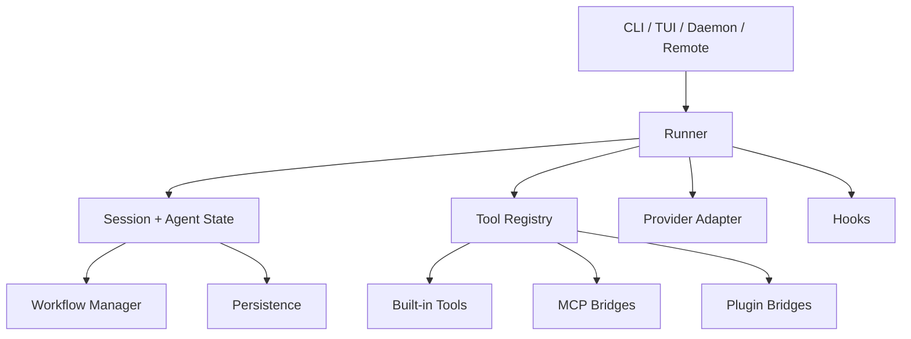
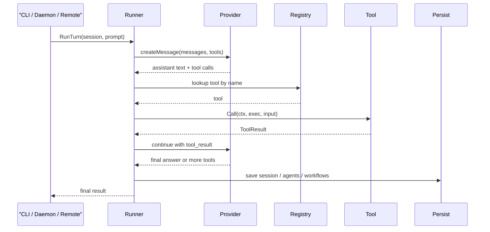

# xxx-code Extension Architecture

## 为什么要有这份文档

`xxx-code` 已经不是“一个带几个工具的 CLI”，而是一个逐渐成型的 agent runtime。  
当系统开始同时支持：

- 内建 tool
- plugin tool
- MCP tool
- hook
- multi-agent
- workflow
- daemon / remote

真正重要的就不再是“功能有没有”，而是“边界稳不稳、扩展点清不清楚”。

这份文档的目标，是把 `xxx-code` 当前最核心的扩展设计边界明确下来，便于后续继续往更通用的 multi-agent 平台演进。

## 总体分层

可以把 `xxx-code` 理解成五层：



各层职责大致如下：

| 层 | 职责 |
| --- | --- |
| 入口层 | CLI、TUI、daemon、remote client |
| runner 层 | 多轮 agent loop、tool calling、上下文压缩、事件分发 |
| state 层 | session、agent、workflow、持久化 |
| registry 层 | 统一 tool 注册与查找 |
| extension 层 | built-in / MCP / plugin / hooks |

## 核心稳定边界：Tool Interface

当前系统最关键的稳定抽象是：

```go
type Tool interface {
    Definition() ToolDefinition
    Call(ctx context.Context, exec *ExecutionContext, input json.RawMessage) (ToolResult, error)
}
```

这条边界非常重要，因为：

- provider 只需要知道有哪些 tool definition
- runner 只需要知道怎么按名字找 tool 并执行
- built-in tool、plugin、MCP 最终都收敛到同一个调用模型

也就是说，`xxx-code` 的“扩展性”不是靠很多平行子系统堆出来的，而是先把所有扩展都折叠到统一 tool registry。

## 为什么 plugin 和 MCP 最终都要桥接成 Tool

如果 plugin、MCP 各自有独立调用协议，系统很快会出现几个问题：

- 模型要学习多套调用面
- 权限策略无法统一
- tool event、审计、benchmark 无法统一
- daemon / remote 需要重复暴露很多接口

当前实现选择了另一条路：

### plugin

- manifest 定义 `command tool`
- 运行时把它桥接成 `plugin__...` tool

### MCP

- 连接远端 server
- 把远端 tool 桥接成 `mcp__...` tool
- resource / prompt / health / reload 则通过 support tools 暴露

所以从 runner 视角看：

- 内建工具
- plugin 工具
- MCP 工具

本质都是同一类对象。

## 一次 turn 的主执行流



这里可以看到一个关键点：  
扩展点在 tool 层，但调度权始终在 runner 手里。

这让系统能对所有扩展统一应用：

- timeout
- policy
- hook
- 事件流
- 审计
- 指标

## ExecutionContext 是运行时上下文边界

tool 执行时不会直接拿到整个 app，而是拿到：

- `Runner`
- `Session`
- `WorkingDir`
- `AgentID`
- `AgentName`
- `Depth`

再通过 `ExecutionContext` 暴露受控能力，例如：

- `EnsureReadPath`
- `EnsureWritePath`
- `EnsureBash`

这意味着扩展点并不是完全裸奔的“随便调用内部对象”，而是有一层受控上下文。

## plugin / MCP / built-in 的职责边界

### built-in tool

适合：

- 要深度利用 runtime 内部对象
- 需要强类型状态协作
- 需要稳定成为产品一部分

例子：

- `read_file`
- `bash`
- `agent_spawn`
- `workflow_resume`

### plugin

适合：

- 本地命令行能力
- 快速试验
- 团队内部小工具
- 不想修改主程序源码

### MCP

适合：

- 远程能力
- 共享服务
- 有独立资源目录与 prompt catalog
- 希望跟其他 MCP client 复用同一 server

### hook

适合：

- 旁路事件通知
- 审计补充
- 和外部自动化编排系统对接

hook 不适合当主业务能力，因为它不是给模型直接调用的 tool。

## 为什么 workflow 不单独做成另一套编排引擎

很多系统会把 workflow 做成完全独立的 orchestrator，但 `xxx-code` 现在选择把它做成 runner 的延伸层。

好处有几个：

- 子 agent 继续复用同一套 provider / tool / policy
- workflow 状态能自然落到现有 session / persistence 模型里
- artifact、resume、daemon API 都能复用

所以当前的设计不是：

```text
agent runtime + 另一个 workflow 系统
```

而是：

```text
agent runtime + workflow manager 作为上层编排
```

这对中短期产品化更稳，因为不会过早把系统拆成两套几乎重复的执行内核。

## daemon / remote 为什么也算扩展架构的一部分

扩展并不只发生在 tool 本身，也发生在“运行位置”上。

`xxx-code` 的入口层已经天然支持：

- 本地 CLI / TUI
- daemon 常驻进程
- remote client / remote TUI

这使扩展能力天然具备两种使用方式：

1. 本地直接接入
2. 通过 daemon 远程托管

因此 plugin、MCP、workflow、hooks 这些能力不能只考虑本地 happy path，还要考虑：

- daemon 生命周期
- remote API 命面对齐
- session 恢复
- 审计和 ACL

## 治理边界

扩展能力真正难的不是“能不能跑”，而是“接进来后会不会把 runtime 变成不可控系统”。

当前 `xxx-code` 的治理边界主要有：

### 1. PermissionPolicy

约束：

- 读路径
- 写路径
- bash enable/disable
- bash allow / deny prefix
- tool allow / deny list

### 2. daemon 安全面

约束：

- bearer token
- ACL mode
- session prefix ACL
- rate limit
- audit

### 3. runtime 观测面

约束和可见性：

- hook event
- audit event
- metrics
- pprof
- benchmark

所以扩展设计不是“开放一切”，而是“开放在受控 runtime 里”。

## 选择扩展形式的决策表

| 需求 | 更推荐的形式 |
| --- | --- |
| 我有一个本地脚本，想很快接进来 | plugin |
| 我有一个远程服务，想提供多个工具 | MCP |
| 我需要代码级深度集成和内部状态协作 | built-in tool |
| 我只想在事件发生时通知外部系统 | hook |
| 我想做复杂多 agent 编排 | workflow + agent tools |

## 未来演进时应尽量保持稳定的边界

如果后续要把 `xxx-code` 继续演进成更通用的平台，这几条边界尽量不要轻易破坏：

### 1. Tool 仍然是统一扩展单元

哪怕未来加更多能力，也最好最终都能映射回统一 tool 调用模型。

### 2. runner 仍然掌握调度权

不要让 plugin、MCP 或 workflow 绕开 runner 自己做另一套隐式主循环，否则 timeout、审计、metrics 很快会失真。

### 3. session / agent / workflow 状态仍然可持久化

一旦扩展能力无法落到可恢复状态，daemon 和 long-running runtime 的价值会明显下降。

### 4. 本地与远程命面尽量对齐

这会直接影响系统是否能从“本地工具”自然演进成“远程 agent 基础设施”。

## 总结

`xxx-code` 当前的扩展设计可以概括成一句话：

> 用统一 tool registry 折叠多种扩展能力，再让 runner 统一调度、治理和观测。

这套设计的优点不是“最炫”，而是：

- 结构收敛
- 运行时行为一致
- 适合持续演进

对于一个目标是长期可部署、可扩展、可治理的 Go agent runtime 来说，这比单纯把功能堆上去更重要。
